# Admin Schema Table + ERD

## 원칙

- `bookings`, `booking_items`, `booking_passengers`, `payment_*`는 공통 예약/결제 축으로 유지한다.
- 숙소 도메인만 `hotel_*` 접두사로 정리한다.
- `flight`, `rentcar`, `special`, `usim`, `admin`은 도메인별 접두사로 분리한다.
- `booking_passengers`는 공통 예약 트리에 속하므로 `flight_passengers`로 바꾸지 않는다.

## 도메인별 표

| 도메인 | 주요 테이블 | 역할 | 주 연결 front/admin 경로 |
| --- | --- | --- | --- |
| 공통 예약 | `bookings`, `booking_items`, `booking_passengers` | 예약 본문, 예약 항목, 탑승객/이용자 공통 트리 | `front/admin/pages/reservations.html`, `front/admin/js/reservations.js` |
| 공통 결제 | `payment_attempts`, `payment_transactions`, `payment_refunds` | 결제 시도, 승인 거래, 환불 이력 | `front/admin/pages/reservations.html`, `front/admin/js/reservations.js` |
| 호텔 | `hotel_properties`, `hotel_room_types`, `hotel_benefits`, `hotel_display_overrides`, `hotel_tags`, `hotel_inventory_stocks`, `hotel_inventory_adjustments`, `hotel_price_policies` | 숙소 마스터, 객실, 혜택, 노출, 태그, 재고, 재고 조정, 가격 정책 | `front/admin/pages/lodging.html`, `front/admin/js/lodging.js` |
| 항공 | `flight_routes`, `flight_schedules`, `flight_fare_policies`, `flight_products`, `flight_inventory_stocks` | 노선, 운항 스케줄, 운임 정책, 판매 상품, 좌석 재고 | `front/admin/pages/lodging.html`, `front/admin/js/lodging.js`, `front/admin/pages/reservations.html`, `front/admin/js/reservations.js` |
| 렌터카 | `rentcar_branches`, `rentcar_vehicle_models`, `rentcar_products`, `rentcar_rate_policies`, `rentcar_inventory_stocks` | 지점, 차량 모델, 판매 상품, 요금 정책, 재고 | `front/admin/pages/lodging.html`, `front/admin/js/lodging.js`, `front/admin/pages/reservations.html`, `front/admin/js/reservations.js` |
| 바우처/쿠폰 | `voucher_products`, `voucher_product_benefits`, `coupons`, `user_coupons` | 판매 바우처, 혜택, 쿠폰 마스터, 사용자 발급 쿠폰 | `front/admin/pages/lodging.html`, `front/admin/js/lodging.js`, `front/admin/pages/members.html`, `front/admin/js/members.js` |
| 특가 | `special_products`, `special_inventory_stocks` | 특가/부가상품 마스터, 재고 | `front/admin/pages/lodging.html`, `front/admin/js/lodging.js` |
| 유심 | `usim_products`, `usim_inventory_stocks` | USIM/eSIM 상품 마스터, 재고 | `front/admin/pages/lodging.html`, `front/admin/js/lodging.js` |
| CMS/배너 | `notices`, `faqs`, `cms_pages`, `cms_blocks`, `content_items`, `banner_slots`, `banners`, `exposure_rules` | 공지/FAQ, CMS 구조, 배너 슬롯/배너 본문, 노출 규칙 | `front/admin/pages/cms.html`, `front/admin/js/cms.js` |
| 회원/권한 | `users`, `user_profiles`, `roles`, `permissions`, `role_permissions`, `user_roles`, `membership_plans`, `membership_plan_benefits`, `user_memberships`, `user_blacklists` | 회원 기본 정보, 프로필, 권한 모델, 멤버십, 차단 | `front/admin/pages/members.html`, `front/admin/js/members.js`, `front/admin/js/rbac_config.js` |
| 고객센터 | `support_categories`, `support_tickets`, `support_comments`, `support_attachments` | 문의 분류, 문의 본문, 댓글/내부 메모, 첨부 메타데이터 | `front/admin/pages/members.html`, `front/admin/js/members.js` |
| 운영/관리 | `admin_action_logs`, `admin_preferences`, `admin_role_scopes`, `dashboard_metric_snapshots` | 관리자 감사 로그, 관리자 설정, 역할 스코프, 대시보드 스냅샷 | `front/admin/pages/dashboard.html`, `front/admin/js/dashboard.js`, `front/admin/pages/members.html`, `front/admin/js/members.js` |

## 테이블별 핵심 메모

| 테이블 | 설명 | 비고 |
| --- | --- | --- |
| `bookings` | 예약 공통 헤더 | 도메인 값은 `booking_type`으로 구분 |
| `booking_items` | 예약 공통 상품 항목 | 항공/숙박/렌터카/바우처를 같이 담음 |
| `booking_passengers` | 예약 공통 탑승객/이용자 | 항공 전용으로 분리하지 않음 |
| `hotel_properties` | 숙소 마스터 | 기존 `properties` 리네임 |
| `hotel_room_types` | 숙소 객실 타입 | 기존 `property_room_types` 리네임 |
| `hotel_inventory_stocks` | 숙소 재고 | 기존 `inventory_stocks` 리네임 |
| `hotel_price_policies` | 숙소 가격 정책 | 기존 `price_policies` 리네임 |
| `flight_products` | 항공 판매 상품 | 노선/스케줄/운임 정책과 분리된 판매 마스터 |
| `rentcar_products` | 렌터카 판매 상품 | 차량 모델/지점 기반 판매 단위 |
| `special_products` | 특가/부가상품 | 쿠폰과 별도 판매 상품 축 |
| `usim_products` | USIM/eSIM 상품 | voucher와 구분되는 전용 상품 축 |
| `admin_role_scopes` | admin 역할별 업무 스코프 | `rbac_config.js`의 역할 모델 보조 |
| `dashboard_metric_snapshots` | 대시보드 집계 스냅샷 | 실시간 집계 부담 완화용 |

## Front 연결 요약

| 화면 | 기대 엔터티 |
| --- | --- |
| `dashboard.html` | 예약/결제/환불/회원/운영로그 + `dashboard_metric_snapshots` |
| `cms.html` | 공지, FAQ, CMS 블록, 배너, 노출 규칙 |
| `lodging.html` | 호텔/항공/렌터카/바우처/특가/유심 상품 관리 |
| `members.html` | 회원, 멤버십, 권한, 문의, 관리자 역할 스코프 |
| `reservations.html` | 예약, 결제, 환불, traveler/passenger |

## ERD

```mermaid
erDiagram
    USERS ||--o{ USER_PROFILES : has
    USERS ||--o{ USER_ROLES : has
    ROLES ||--o{ USER_ROLES : assigned_to
    ROLES ||--o{ ROLE_PERMISSIONS : grants
    PERMISSIONS ||--o{ ROLE_PERMISSIONS : maps
    USERS ||--o{ USER_BLACKLISTS : may_be
    MEMBERSHIP_PLANS ||--o{ MEMBERSHIP_PLAN_BENEFITS : includes
    USERS ||--o{ USER_MEMBERSHIPS : subscribes
    MEMBERSHIP_PLANS ||--o{ USER_MEMBERSHIPS : linked

    BOOKINGS ||--o{ BOOKING_ITEMS : contains
    BOOKINGS ||--o{ BOOKING_PASSENGERS : includes
    BOOKING_ITEMS ||--o{ BOOKING_PASSENGERS : scopes
    BOOKINGS ||--o{ PAYMENT_ATTEMPTS : attempts
    PAYMENT_ATTEMPTS ||--o{ PAYMENT_TRANSACTIONS : results
    PAYMENT_TRANSACTIONS ||--o{ PAYMENT_REFUNDS : refunds

    HOTEL_PROPERTIES ||--o{ HOTEL_ROOM_TYPES : has
    HOTEL_PROPERTIES ||--o{ HOTEL_BENEFITS : has
    HOTEL_PROPERTIES ||--o{ HOTEL_TAGS : tagged
    HOTEL_PROPERTIES ||--|| HOTEL_DISPLAY_OVERRIDES : overrides
    HOTEL_ROOM_TYPES ||--o{ HOTEL_INVENTORY_STOCKS : inventory
    HOTEL_INVENTORY_STOCKS ||--o{ HOTEL_INVENTORY_ADJUSTMENTS : adjusted_by
    HOTEL_PROPERTIES ||--o{ HOTEL_PRICE_POLICIES : priced
    HOTEL_ROOM_TYPES ||--o{ HOTEL_PRICE_POLICIES : optional_room_scope

    FLIGHT_ROUTES ||--o{ FLIGHT_SCHEDULES : schedules
    FLIGHT_ROUTES ||--o{ FLIGHT_FARE_POLICIES : fares
    FLIGHT_SCHEDULES ||--o{ FLIGHT_FARE_POLICIES : optional_schedule_scope
    FLIGHT_ROUTES ||--o{ FLIGHT_PRODUCTS : sells
    FLIGHT_SCHEDULES ||--o{ FLIGHT_INVENTORY_STOCKS : inventory

    RENTCAR_BRANCHES ||--o{ RENTCAR_PRODUCTS : offers
    RENTCAR_VEHICLE_MODELS ||--o{ RENTCAR_PRODUCTS : models
    RENTCAR_BRANCHES ||--o{ RENTCAR_RATE_POLICIES : rates
    RENTCAR_VEHICLE_MODELS ||--o{ RENTCAR_RATE_POLICIES : rates
    RENTCAR_PRODUCTS ||--o{ RENTCAR_INVENTORY_STOCKS : inventory

    VOUCHER_PRODUCTS ||--o{ VOUCHER_PRODUCT_BENEFITS : includes
    SPECIAL_PRODUCTS ||--o{ SPECIAL_INVENTORY_STOCKS : inventory
    USIM_PRODUCTS ||--o{ USIM_INVENTORY_STOCKS : inventory
    COUPONS ||--o{ USER_COUPONS : issued
    USERS ||--o{ USER_COUPONS : receives

    SUPPORT_CATEGORIES ||--o{ SUPPORT_TICKETS : classifies
    USERS ||--o{ SUPPORT_TICKETS : owns
    SUPPORT_TICKETS ||--o{ SUPPORT_COMMENTS : comments
    SUPPORT_TICKETS ||--o{ SUPPORT_ATTACHMENTS : attachments

    CMS_PAGES ||--o{ CMS_BLOCKS : contains
    CMS_BLOCKS ||--o{ CONTENT_ITEMS : contains
    BANNER_SLOTS ||--o{ BANNERS : contains
    EXPOSURE_RULES }o--|| BANNERS : targets

    USERS ||--o{ ADMIN_ACTION_LOGS : acts
    USERS ||--o{ ADMIN_PREFERENCES : stores
    ADMIN_ROLE_SCOPES }o--|| ROLES : scopes
```

## 한 줄 정리

`bookings`는 공통 예약 트리로 남기고, 숙소는 `hotel_*`, 나머지 상품군은 `flight_* / rentcar_* / special_* / usim_* / voucher_* / admin_*` 접두사로 읽히게 정리하는 구조다.
